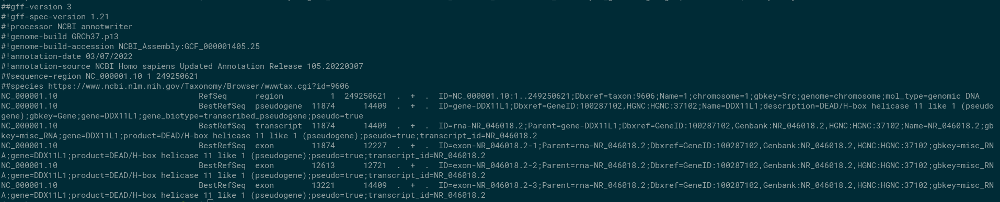

# gene_annotation2bed

## Purpose
To provide bed files for custom gene-level annotation with VEP.
This custom script processes a list of ids (HGNC, transcript) or coordinates with associated annotation, into a comprehensive bed file for the corresponding refseq transcripts for each ID entry.

i.e It could take a list of genes with associated annotation for example Gene A is an oncogene.
It would then find all the corresponding transcripts for that gene and create a bed file for annotating VCFs using VEP. This removes the reliance on picking gene coordinates and directly annotates transcripts we use for our pipelines.

This Bed file can then be used to provide custom annotation with VEP, see VEP documentation for further details on using custom annotation ([VEP Docs](https://www.ensembl.org/info/docs/tools/vep/script/vep_custom.html)).

Note: The following steps must be completed before the BED can be used with VEP.

```bash
grep -v "#" myData.bed | sort -k1,1 -k2,2n -k3,3n -t$'\t' | bgzip -c > myData.bed.gz
tabix -p bed myData.bed.gz
```

When using VEP, the JSON should specify 'overlap' as in the VEP custom documentation when annotating gene/transcript level annotation. For more information on how to use custom annotation please see:
[Internal Document which is helpful](https://cuhbioinformatics.atlassian.net/wiki/spaces/DV/pages/2605711365/VEP+Config+file).

Workflow diagram showing TSV containing IDs and annotation to bed file and how it is used in VEP and visualised in IGV:


---
## What are typical use cases for this script?

- Converting a list of HGNC ids + associated gene level annotation information
  into a comprehensive bed file for annotation with Ensemble's VEP.
- Other use cases include providing different inputs such a list of transcripts.
  Or using exact coordinates to flag a regions such as TERT promoter.

---
## What data are required for this script to run?

- List of ids and annotation information in TSV format.
- Human Genome Reference (i.e. hs37d5) for generating IGV report.
- RefSeq Transcripts file (gff3; `GCF_000001405.25_GRCh37.p13_genomic.gff`) and corresponding gff assembly report, i.e.`GCF_000001405.25_GRCh37.p13_assembly_report.txt` from 001_reference
  or from [Refseq FTP Server](https://ftp.ncbi.nlm.nih.gov/genomes/refseq/vertebrate_mammalian/Homo_sapiens/all_assembly_versions/).


---
## Notes
The current working logic of this script is to select only refseq transcripts with NM_ prefix.

---

## What inputs are required for this app to run?

### Required
- `-ann`, `--annotation_file` (`str`): Path to the annotation file (TSV), this file is essential for the app to execute successfully.
- `-o`, `output` (`str`): Output file suffix, required for specifying the suffix for the generated output files.
- `-build`, `--genome_build` (`str`): Reference genome build (hg19/hg38), choose either 'hg19' or 'hg38' based on your requirements.
- `-f`, `--flanking` (`int`): Flanking size, an integer value representing the size of flanking regions for each gene, transcript or coordinates provided. Default = 0.
- `-as`, `--assembly_report` (`str`): Path to assembly report file, necessary for the app to gather assembly information, this allows for the script to map between refseq accessions and chromosomes. i.e. `GCF_000001405.25_GRCh37.p13_assembly_report.txt`.
- `-gff` (`str`): Path to GFF file containing all relevant transcripts for assay, available in 001_reference i.e. `GCF_000001405.25_GRCh37.p13_genomic.gff`.

### Useful ones

#### Files
- `-ref_igv`, `--reference_file_for_igv` (`file`): Path to the Reference genome fasta file for igv_reports, used in generating IGV reports.

## Misc
- `--pickle` or `-pkl` (`str`): Import GFF as a pickle file, this is for testing mostly to speed-up running, so gff isn't processed each time.

## Example Command

```bash
python gene_annotation2bed.py -ann annotation.tsv -o output_suffix -ref hg38 -f 5 --assembly_report assembly_report.txt -ref_igv ref_genome.fasta -gff your_file.gff -pickle pickle_file.pkl
```

---

## Requirements

To generate IGV reports:
HTSlib is required for generating IGV report with the bed file to check the accuracy.
This uses tabix and bgzip. Version: 1.19.1.

General requirements see requirements.txt for more info on versions.

- pysam
- numpy
- pandas
- igv-reports (v1.12.0)
- re (std lib)

install using `requirements.txt`. `pip install requirements.txt`
Alternatively you can use conda and the yml provided.
---

## How does this app work?
Overview of workflow of app.


## IGV reports output

IGV report:


The script produces a HTML report of all the bed file entries. Displayed in IGV with the refseq track
and bed file aligned with the respecive annotation.


